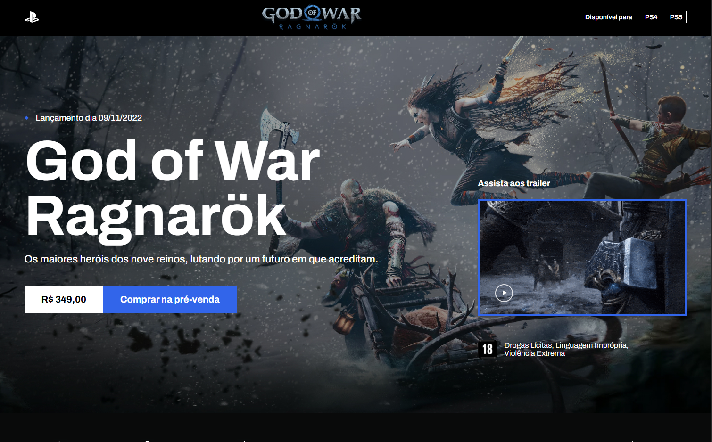

<div align="center">

  # ⚔️ God of War - Ragnarök Landing Page


  
  
  **Uma landing page épica e imersiva para o lançamento de God of War Ragnarök. Design moderno com animações fluidas, carousel interativo de personagens e seção de trailer integrada.**
  
  [](https://developer.mozilla.org/pt-BR/docs/Web/HTML)
  [](https://developer.mozilla.org/pt-BR/docs/Web/CSS)
  [](https://sass-lang.com/)
  [](https://developer.mozilla.org/pt-BR/docs/Web/JavaScript)
  [](https://swiperjs.com/)
  
</div>

## 🚀 Demo Online

<div align="center">

### 🌐 <a href="https://god-of-war-ragnarok.mklly.com.br/" target="_blank" rel="noopener noreferrer">**VER PROJETO AO VIVO**</a>

<a href="https://god-of-war-ragnarok.mklly.com.br/" target="_blank" rel="noopener noreferrer">
  
</a>

</div>

## 📸 Screenshots

<div align="center">

  

</div>

## ✨ Funcionalidades

- � **Player de Trailer**: Botão interativo para reprodução do trailer oficial
- 🎠 **Carousel de Personagens**: Slider responsivo com os principais personagens
- 🎨 **Design Imersivo**: Interface que captura a essência visual do jogo
- 📱 **Layout Responsivo**: Adaptação perfeita para todos os dispositivos
- ⚡ **Animações Fluidas**: Transições suaves e efeitos visuais envolventes
- 🎯 **Seção de Pré-venda**: Call-to-action estratégico para compras
- 📋 **Informações Técnicas**: Detalhes sobre compatibilidade e recursos do jogo
- 🏷️ **Classificação Etária**: Informações oficiais sobre faixa etária

## 🎯 Destaques do Design

- **Hero Section**: Banner principal com informações de lançamento e preço
- **Seção Storyline**: Narrativa envolvente sobre a jornada de Kratos e Atreus
- **Galeria de Personagens**: Cards interativos com os principais protagonistas
- **Informações Técnicas**: Ícones e detalhes sobre recursos do PlayStation
- **Branding Oficial**: Logos e elementos visuais oficiais da Sony/Santa Monica

## 📁 Estrutura do Projeto

```
📦 god-of-war-landing
├── 📄 index.html              # Página principal
├── 📄 README.md
├── 📁 css/
│   └── 📄 main.css           # Estilos compilados
├── 📁 scss/
│   ├── 📄 _reset.scss        # Reset de estilos
│   ├── 📄 _grid.scss         # Sistema de grid
│   ├── 📄 _header.scss       # Estilos do cabeçalho
│   ├── � _home.scss         # Estilos das seções principais
│   ├── 📄 _patterns.scss     # Padrões reutilizáveis
│   └── 📄 main.scss          # Arquivo principal SCSS
├── 📁 js/
│   └── 📄 main.js            # Configuração do Swiper
└── 📁 img/
    ├── 📄 *.jpg              # Imagens dos personagens
    ├── 📄 *.png              # Ícones e logos
    └── 📄 *.svg              # Vetores e ícones
```

## 💻 Como Executar

1. **Clone o repositório**
```bash
git clone https://github.com/marquesmaycon/god-of-war-ragnarok.git
```

2. **Navegue até a pasta**
```bash
cd god-of-war-ragnarok
```

3. **Abra o projeto**
   - Abra o arquivo `index.html` no seu navegador
   - Ou use um servidor local como Live Server (VS Code)

## 🛠️ Principais Implementações

### Carousel Responsivo com Swiper.js
```javascript
var swiper = new Swiper(".slide-characters", {
   slidesPerView: 3.5,
   spaceBetween: 19,
   freeMode: true,
   breakpoints: {
      320: { slidesPerView: 1.1 },
      768: { slidesPerView: 2.2 },
      991: { slidesPerView: 2.8 },
      1200: { slidesPerView: 3.5 }
   }
});
```

### Arquitetura SCSS Modular
- **Componentização**: Estilos organizados por seções
- **Mixins e Variáveis**: Reutilização eficiente de código
- **Sistema de Grid**: Layout flexível e responsivo
- **Reset Customizado**: Base sólida para estilos

### Design System
- **Tipografia**: Fonte Archivo para legibilidade
- **Paleta de Cores**: Tons escuros que remetem ao universo do jogo
- **Breakpoints**: Design mobile-first com 4 pontos de quebra
- **Animações**: Transições CSS suaves e naturais

## 🎨 Destaques Técnicos

- **CSS Grid & Flexbox**: Layout moderno e flexível
- **SCSS**: Pré-processamento para código mais limpo
- **Swiper.js**: Biblioteca robusta para carousels
- **Mobile-First**: Abordagem responsiva moderna
- **Semantic HTML**: Estrutura acessível e SEO-friendly
- **Performance**: Otimização de imagens e assets

## ⚔️ Personagens Incluídos

**Kratos** - Deus da Guerra, protagonista principal
**Atreus** - Filho de Kratos, co-protagonista  
**Mímir** - Conselheiro e aliado leal
**Freya** - Mãe de Baldur, personagem complexa
**Thor** - Deus do Trovão, antagonista poderoso
**Týr** - Deus da Guerra Nórdico, aliado misterioso

## 👨‍💻 Autor

<div align="center">
  
  <br/>
  <strong>Maycon Marques</strong>
  <br/>
  <br/>
  
  [](https://www.linkedin.com/in/mayconhenrique/)
  [](https://github.com/marquesmaycon)
  [](mailto:mayconmarquesh@gmail.com)

  ### Feito com ❤️ e muita 🎵
</div>